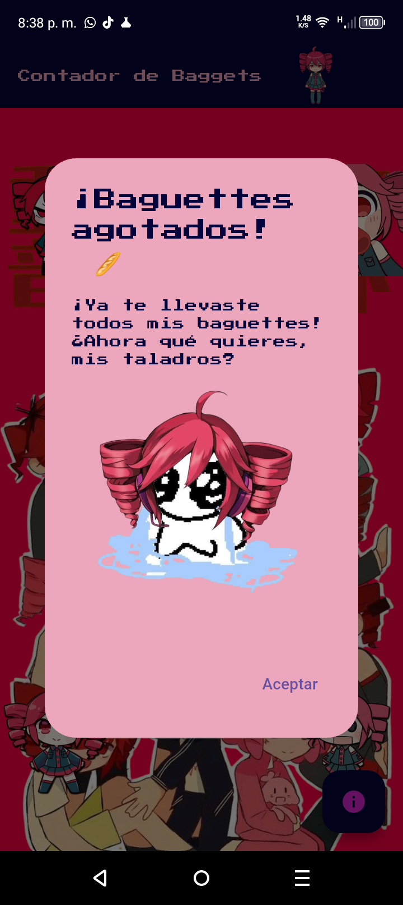
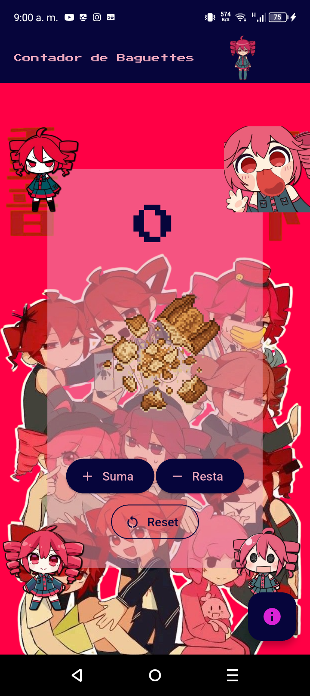

# Contador de Baguettes 🥖

¡Una aplicación contadora básica hecha en **Flutter** con temática de **Kasane Teto**!

## 👥 Autor

- [@Acthel12](https://github.com/Acthel12)

## 📱 Demostración


| Alerta | Vista Principal | Info |
| :---: | :---: | :---: |
|  |  |  |

---

## 🎤 ¿Quién es Kasane Teto?


**Teto Kasane** (重音テト) es un personaje y banco de voz creado originalmente en el foro japonés *2channel* para el Día de los Inocentes de 2008. A pesar de haber nacido como una broma, se desarrolló un banco de voz real para ella utilizando el software de síntesis de voz **UTAU**, lo que le permitió cantar. Hoy en día es mundialmente conocida como la "diva nacida de un engaño".

> 📚 *colaboradores de Wikipedia. (2026b, mayo 28). Teto Kasane. Wikipedia, la Enciclopedia Libre. https://es.wikipedia.org/wiki/Teto_Kasane*


---

## 🛠️ Tecnologías y Requisitos

Antes de empezar, asegúrate de tener instalado:
* **Flutter SDK** (Versión 3.x o superior)
* **Dart SDK**
* Un emulador (Android/iOS) o un dispositivo físico configurado.

---

## 🚀 Instalación y Ejecución

Si deseas probar el proyecto localmente, sigue estos pasos:

1. **Clonar el repositorio:**
   ```bash
   git clone https://github.com/Acthel12/Contador_Baguettes-Kasane_Teto-.git
   ```
2. **Instalar las dependencias de Flutter:**
   ```bash
   flutter pub get
   ```
3. **Ejecutar la aplicación:**
   ```bash
   flutter run
   ```
